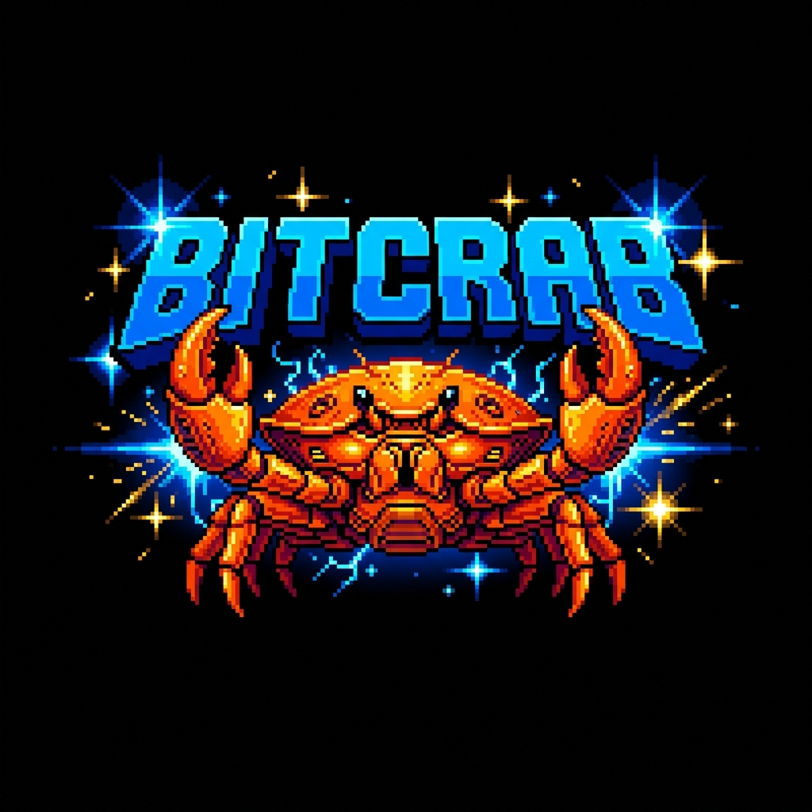

<div align="center">
  
  <br>
  <h1>Bitcrab</h1>
  <p><strong>A High-Performance, Simplicity-Driven Bitcoin Full Node in Rust</strong></p>

  [](https://opensource.org/licenses/MIT)
  [](https://www.rust-lang.org/)
  [](#)
</div>

---

Bitcrab is a minimal, educational, yet production-inspired Bitcoin full node implementation. The project prioritizes readability, correctness, and a clean architecture that avoids the bloat found in legacy clients.

## 🧭 Philosophy

Many long-established clients accumulate bloat over time. This often occurs due to the need to support legacy features for existing users or through attempts to implement overly ambitious software. The result is often complex, difficult-to-maintain, and error-prone systems.

In contrast, the philosophy behind Bitcrab is rooted in **simplicity**. I believe in writing minimal code, prioritizing clarity, and embracing simplicity in design. This approach is the best way to build a client that is both fast and resilient. By adhering to these principles, I can iterate fast and explore next-generation features early, ensuring the codebase remains a joy to work with.

## 🎨 Design Principles

- **Effortless Setup**: Ensure smooth execution across all target environments.
- **Vertical Integration**: Maintain a minimal amount of dependencies.
- **Extensible Structure**: Built in a way that makes it easy to add new layers (e.g., L2 integration, research VMs) on top.
- **Simple Type System**: Avoid having generics leaking all over the codebase.
- **Few Abstractions**: Do not generalize until strictly necessary. Repeating code twice is often better than a bad abstraction.
- **Readability Over Optimization**: Maintainability is favored over premature and complex optimizations.
- **Principled Concurrency**: Concurrency is utilized only where strictly necessary to maintain node performance, keeping the rest of the codebase easy to reason about.

## 🚀 Key Features

- **Signet Native**: Optimized for the Bitcoin Signet network by default.
- **Component Isolation**: Decoupled P2P, Synchronization, and Storage layers using clean message-passing boundaries.
- **Parallel Header & Block Sync**: A streamlined pipeline that catches up headers instantly while downloading block bodies in parallel.
- **Modular Storage**: Hybrid storage engine with RocksDB metadata indexing and bit-for-bit compatible `blk*.dat` storage.
- **Real-time Monitoring**: Built-in Terminal UI (TUI) for network health and synchronization tracking.
- **Bitcoin Core Compatible RPC**: JSON-RPC 2.0 interface supporting essential audit and blockchain commands.

## 🛠️ Getting Started

### Prerequisites

- [Rust](https://www.rust-lang.org/tools/install) (latest stable version)
- Build tools (for RocksDB dependencies)

### Installation

```bash
git clone https://github.com/emirongrr/bitcrab.git
cd bitcrab
cargo build --release
```

### Running the Node

Start the Bitcrab node on the Signet network:

```powershell
cargo run --release -p bitcrab -- signet run
```

### Running the Monitor

Inspect your node's health in real-time:

```powershell
cargo run -p bitcrab-monitor
```

## 📂 Project Structure

- `cmd/`: Binary entry points (node and monitor).
- `crates/`: Modular core components.
  - `common/`: Core primitives (Hash, Block, Transaction).
  - `net/`: P2P wire protocol and Actor orchestration.
  - `storage/`: RocksDB indexer and flat-file persistence.
  - `consensus/`: Bitcoin rule validation.
- `docs/`: Technical specifications and API guides.

## 📡 RPC API

Bitcrab provides a Bitcoin Core compatible RPC interface on port `8332`.

| Method | Description |
| :--- | :--- |
| `getblockchaininfo` | Returns status of headers and block synchronization. |
| `getblock <hash>` | Retrieves full block data with transaction list. |
| `getpeerinfo` | Lists all active P2P connections and their metadata. |

For a full list of commands, see [RPC Guide](docs/rpc.md).

## 📚 References and acknowledgements

The following links, repositories, companies, and projects have been important in the development of Bitcrab. I have learned a lot from them, and I would like to thank and acknowledge them.

- [Bitcoin Core](https://github.com/bitcoin/bitcoin) - The gold standard of Bitcoin implementations.
- [Ethrex](https://github.com/lambdaclass/ethrex) - Inspiration for the architecture.
- [Lambda Class](https://blog.lambdaclass.com/lambdas-engineering-philosophy/) - For their high-standard open-source and engineering philosophy.

## 📄 License

Bitcrab is licensed under the [MIT License](LICENSE).