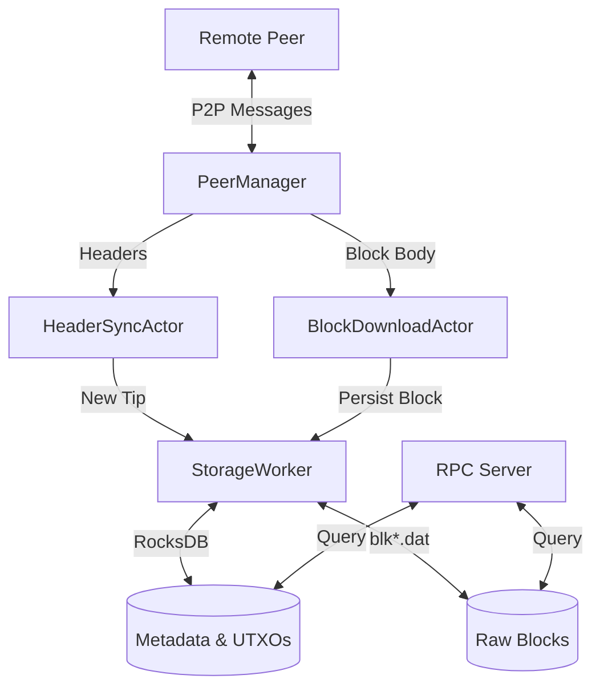

# Architectural Overview

Bitcrab is built on a high-concurrency, message-passing architecture inspired by the Actor Model. This ensures that CPU-bound validation, disk-bound storage, and I/O-bound networking work in harmony without blocking each other.

## Crate Structure

The project is organized into modular crates to enforce clean boundaries and facilitate testing.

| Crate | Responsibility |
| :--- | :--- |
| `bitcrab` | The main binary entry point (CLI and initialization). |
| `bitcrab-common` | Core Bitcoin types: Blocks, Transactions, Script, and Hashing. |
| `bitcrab-net` | P2P protocol, Peer Management, and Synchronization Actors. |
| `bitcrab-storage` | Persistence layer: RocksDB indexing and flat-file block storage. |
| `bitcrab-consensus` | Implementation of Bitcoin's consensus rules and script execution. |
| `bitcrab-monitor` | TUI (Terminal User Interface) for real-time node observation. |

---

## The Actor System

Bitcrab uses specialized actors for critical network and node tasks. Communication happens via asynchronous channels (MPSC).

### 1. PeerManager
Oversees all incoming and outgoing TCP connections. It validates the network magic, handles handshakes, and serves as the gateway for all protocol messages.

### 2. HeaderSyncActor & BlockDownloadActor
These two actors work in a decoupled pipeline:
- **HeaderSync**: Focuses on fetching 80-byte header chains as fast as possible to build the "map" of the blockchain.
- **BlockDownload**: Once headers are known, this actor pulls full block bodies from multiple peers in parallel.

### 3. StorageWorker
A dedicated background worker that serializes all disk mutations. By using a single worker for writes, we ensure atomic updates to the UTXO set and block files without complex database locking.

---

## Data Flow

## Performance Principles

1.  **Non-blocking I/O**: All networking is handled via `tokio` asynchronous runtimes.
2.  **Zero-copy**: Bitcoin messages are encoded/decoded using efficient byte-oriented buffers.
3.  **Read/Write Split**: Storage reads are performed directly via thread-safe `Store` handles, while writes are queued to the `StorageWorker`, maximizing throughput.
