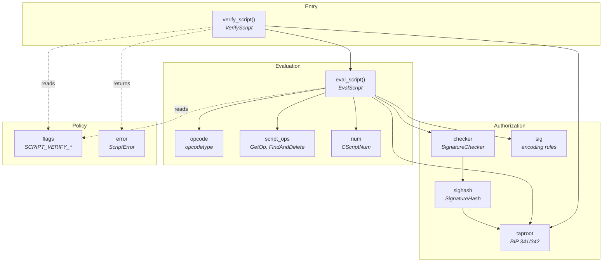
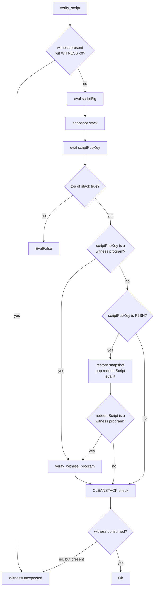
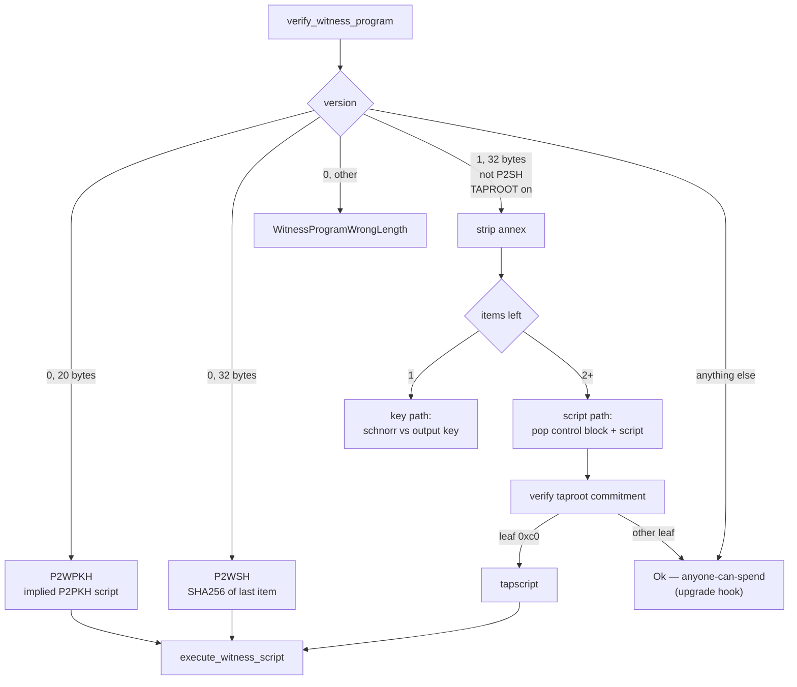
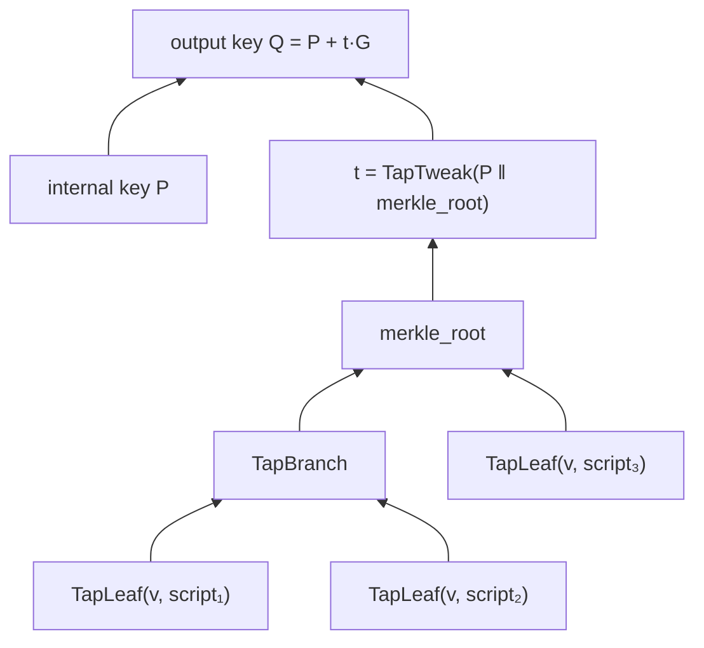

# The native script engine

`bitcrab-script` implements Bitcoin's script consensus rules natively, replacing
`libbitcoinconsensus` as the production verification path. This document
explains how the pieces fit together and why each one exists.

## Why native at all

Bitcrab's purpose is measuring how post-quantum signatures would change Bitcoin.
That requires instrumenting verification — counting operations, swapping
signature schemes, replaying historical scripts under counterfactual rules. A
C++ library behind an FFI boundary that answers only "valid / invalid" cannot
support any of that.

`libbitcoinconsensus` is kept, but demoted to a test oracle: the differential
suite runs both engines over identical inputs and asserts they agree. See
[differential-testing.md](differential-testing.md).

## Module layout

Each module tracks one part of Bitcoin Core's `src/script/`, so a rule can be
compared against its reference side by side.

The dependency direction matters: **evaluation never reaches into the
transaction**. `eval_script` only knows about a stack, a script and a
`&dyn SignatureChecker`. That indirection is what lets the same interpreter
serve real block validation, the BIP 325 signet block-solution check, and unit
tests driven by a stub checker.

## Verification flow

`verify_script` is the only entry point. It dispatches on the *shape* of the
output being spent:

The stack snapshot exists because P2SH re-runs from the state *after* the
scriptSig but *before* the scriptPubKey — the redeemScript is whatever the
scriptSig left on top. Core does the same with a `stackCopy` swap.

### Witness dispatch

Case `G` is the soft-fork upgrade hook, and it is also the sharpest edge in the
whole engine: an unknown witness version is *spendable by anyone* as far as this
node is concerned. That is correct — it is how a pre-taproot node treats a
taproot output — but it means every gate leading to it has to be right. Taproot
is deliberately excluded under P2SH, matching BIP 341, because wrapping it would
reintroduce the txid malleability segwit removed.

## Signature hashing

Three schemes, chosen by `SigVersion`:

| SigVersion | Scheme | Commits to | Reference |
|---|---|---|---|
| `Base` | Legacy | mutated tx copy | `SignatureHash` |
| `WitnessV0` | BIP 143 | + spent amount | `SignatureHash` |
| `Taproot` | BIP 341, `ext_flag=0` | + **all** spent outputs | `SignatureHashSchnorr` |
| `Tapscript` | BIP 341, `ext_flag=1` | + leaf hash, codesep position | `SignatureHashSchnorr` |

The taproot rows are why `TransactionSignatureChecker` takes the whole
`&[TxOut]` prevout set rather than a single amount: BIP 341 hashes every spent
output's value *and* scriptPubKey.

Midstates are precomputed once per transaction in
`PrecomputedTransactionData`. Recomputing them per input would make segwit and
taproot validation quadratic in the number of inputs — the exact problem BIP 143
was introduced to fix.

### Quirks reproduced on purpose

Consensus is defined by what Core does, not by what is sensible. These are
deliberate:

- **`SIGHASH_SINGLE` bug** — signing an input with no output at the same index
  returns the constant hash `0x0000…0001` instead of failing. A 2010 bug, now
  permanent.
- **`CHECKMULTISIG` off-by-one** — pops one element more than it needs. BIP 147
  later required that element to be the empty push, but the pop itself stays.
- **`FindAndDelete`** — the signature being checked is stripped out of the
  scriptCode it appears in, on opcode boundaries. Removed by BIP 143, so it
  applies only to `SigVersion::Base`.

## Taproot commitment

A taproot output is a single 32-byte key `Q` that hides both a key-path owner
and a tree of alternative scripts:

A key-path spend proves knowledge of the discrete log of `Q`. A script-path
spend reveals one leaf plus the sibling hashes needed to recompute `merkle_root`,
and the node checks `Q == P + t·G` via `tweak_add_check`.

Sibling pairs are sorted lexicographically before hashing, so the proof carries
no left/right direction bits — that is why `compute_taproot_merkle_root` sorts
rather than following a path encoding.

## Error typing

`ScriptError` mirrors Core's `ScriptError_t` one-to-one. This is not cosmetic:
`libbitcoinconsensus` collapses every failure into a single error code, so when
the differential suite reports a disagreement, Bitcrab's typed error is the only
thing that says *which rule* diverged.

It also removes a class of bug this codebase hit three separate times. The old
API returned `Result<bool, _>`, and callers wrote `verify(...)?` — discarding the
`bool`, so a script that evaluated to *false* was treated as valid. Every
verification entry point now returns `Result<(), ScriptError>`, where success has
no other representation.

## What is not implemented

Stated plainly, because silence here reads as coverage:

- **Consensus rules outside script.** Block subsidy, witness commitment
  validation, BIP 34 coinbase height, median-time-past, coinbase maturity, block
  weight, duplicate inputs and sigop counting are not enforced by
  `bitcrab-consensus` yet. `ConsensusParams` still carries the activation
  heights as chain description, but nothing reads them.
- **Chain reorganisation.** Undo data is written but never applied; the
  chainstate only walks forward.
- **Taproot annex semantics.** The annex is stripped and committed to by the
  signature, which is all BIP 341 currently defines. Any future meaning is not
  implemented.
