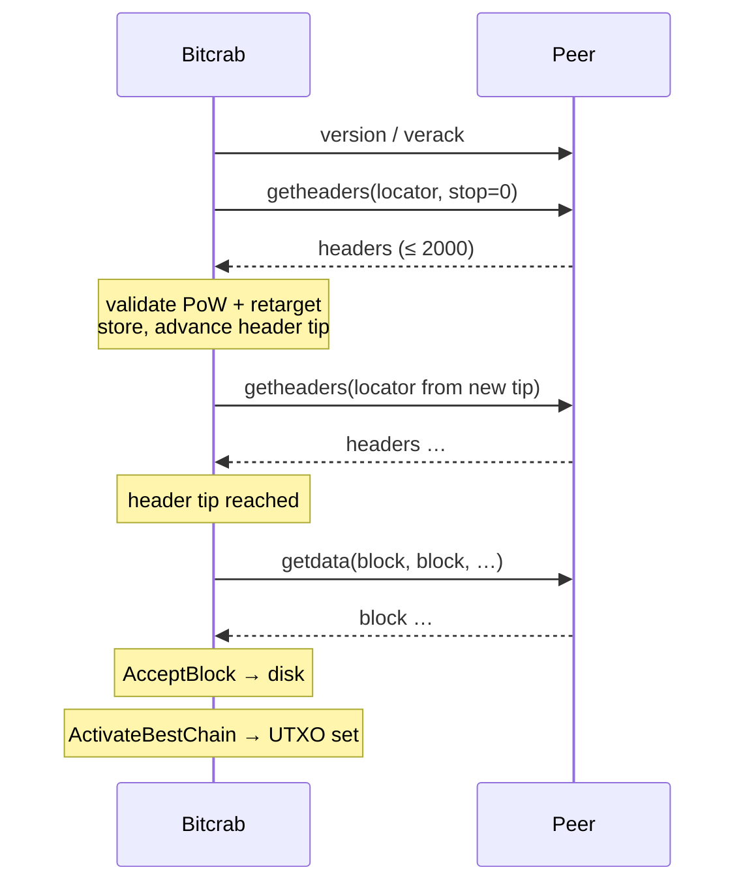
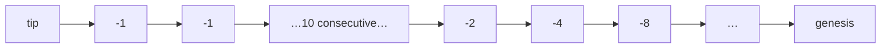
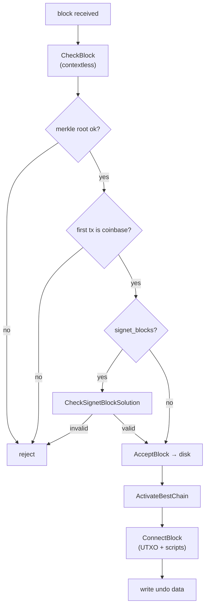
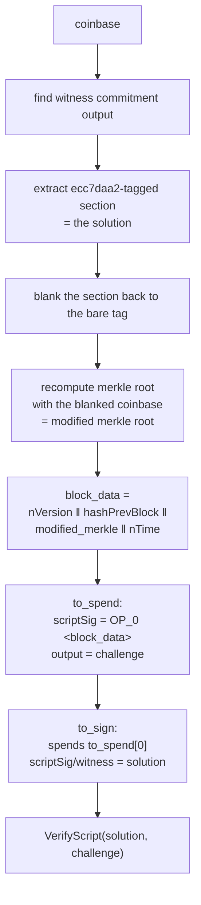

# Signet synchronisation

How Bitcrab finds signet peers, agrees with them on a common chain, and decides
a block is valid. This document covers the two mechanisms that were the
difference between "connects" and "actually syncs": the block locator and the
BIP 325 block-solution check.

## Why signet needs its own document

Signet blocks carry no meaningful proof of work — the difficulty is trivial by
design. What makes a signet block authoritative is a **signature** over it,
committed inside the coinbase, verified against a challenge script baked into
the chain parameters.

That has a consequence worth stating bluntly: on signet, the BIP 325 check is
the *only* thing separating the real chain from one anybody can mint on a
laptop. It is not a nicety.

## Header synchronisation

Headers-first, like Core: fetch and validate the header chain, then download the
bodies in parallel, then connect them to the UTXO set.

### The block locator

A locator is the list of hashes a peer uses to find the last block both sides
have. It starts dense and steps back exponentially, always ending at genesis:

Bitcrab previously sent a locator containing only the tip hash. That is not a
valid locator, and the failure mode is quiet rather than loud: if the peer does
not have that exact block, Core's `FindForkInGlobalIndex` falls back to genesis
and replies from height 1. The node then re-downloads the whole header chain,
fails to advance, and asks again — forever. Reorg recovery is impossible for the
same reason.

`build_block_locator` reproduces Core's `GetLocator` exactly, including the
detail that the step doubles *after* the next height is computed, which is what
puts the first widened gap at entry 12 rather than entry 11.

### Partial header batches

A `headers` message whose parent is unknown used to abort the whole message,
discarding up to 2000 already-validated headers. Now the batch is truncated at
the gap and the connected prefix is committed.

That fix exposed a second bug: `on_headers` took the new tip hash from
`headers.last()` and its height from `heights.last()` independently. Once a
batch could be shorter than the message, those two disagreed, and the node would
advance its tip to a header it had never accepted. They are now paired from the
same index.

## Block validation

The signet check sits in `CheckBlock`, before any chainstate is touched. It used
to run at the *end* of `ConnectBlock`, after `view.add_coin` and
`set_best_block` had already mutated the UTXO set — so an unsigned block left
state behind even when rejected.

It is gated on `consensus.signet_blocks`, not on the message-start bytes. A
custom signet has its own magic but the same requirement; gating on magic meant
custom signets skipped verification entirely.

## BIP 325 in detail

Two details carry the whole design:

**Why the section is blanked.** The signature covers the merkle root, but the
signature itself lives inside the coinbase, which is *in* that merkle tree. A
signature cannot commit to itself. Blanking the section to its bare tag gives a
stable pre-image that both signer and verifier can reconstruct.

**Why `nBits` and `nNonce` are excluded** from `block_data`: signet's proof of
work is meaningless, so the signer does not commit to it. Only version, previous
hash, modified merkle root and time are signed.

The check runs with Core's `BLOCK_SCRIPT_VERIFY_FLAGS` — P2SH, DERSIG, NULLDUMMY,
WITNESS, TAPROOT — so bare-multisig (the public signet), P2SH, P2WSH and taproot
challenges are all really evaluated.

### Fail-closed on unverifiable challenges

The engine treats an unknown witness version as anyone-can-spend. For a
*transaction* that is correct upgrade behaviour. For a *block challenge* it
would mean accepting every block, so `is_unsupported_challenge` refuses v2+
witness programs explicitly rather than letting them through.

## Assume-valid

`ActivateBestChain` skips script verification for blocks at or below the
`assumevalid` hash from `ConsensusParams`. The hash is resolved to a height
through the block index at activation time; an unknown hash yields "no
assume-valid", which means full verification. Failing toward more checking is
the only safe direction.

This replaced a hardcoded height/hash pair that existed alongside the params
field — two sources of truth for the same fact, which is how they drift apart.

## Known gaps

- No reorg: undo data is written but never applied.
- `n_minimum_chain_work` is stored but not enforced, so low-work header floods
  are not rejected.
- Consensus rules listed in [script-engine.md](script-engine.md#what-is-not-implemented)
  remain unimplemented; block bodies are accepted on merkle root, coinbase
  shape, and script validity alone.
