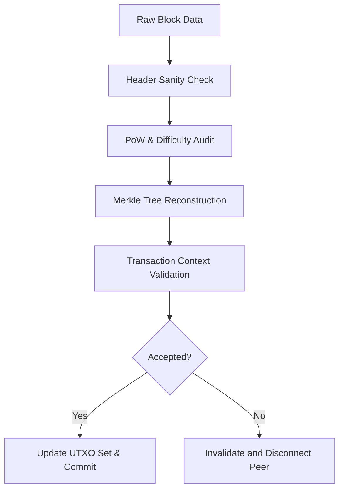

# Consensus Validation Specification

This document outlines the consensus rules implemented in Bitcrab to ensure full compatibility with the Bitcoin network protocols.

## 🏛️ Bitcoin Core "Gold Standard" Reference

Consensus is the set of rules that every node must follow to reach a single "truth" about the state of the blockchain.

### 1. Block Header Validation
Every block must satisfy the following header rules:
- **Previous Hash**: Must point to the current best block tip.
- **Merkle Root**: Must match the root of the transaction tree.
- **Difficulty (Target)**: The hash of the header must be less than or equal to the target derived from the `nBits` field.
- **Timestamp**: Must be greater than the median of the previous 11 blocks and not too far in the future (within 2 hours).

### 2. Transaction Integrity
A block is only valid if all its transactions are valid:
- **Coinbase**: Exactly one coinbase transaction per block.
- **Inputs**: All inputs must exist in the current UTXO set (no double-spending).
- **Sum(Inputs) >= Sum(Outputs)**: The total value entering transactions must cover all outputs plus the fee.

---

## 🦀 Bitcrab Implementation: The Validation Engine

I have encapsulated consensus logic into the `bitcrab-consensus` crate to ensure a clean separation between network data and validated state.

### 1. Proof-of-Work Verification
Bitcrab uses a specialized logic to verify work:
- **Bits-to-Target**: I implement the precise Bitcoin Core `ArithUint256` logic to convert the compact `nBits` representation into a 256-bit target for comparison.
- **Chainwork Tracking**: Every block index record stores `chainwork`, which is the total expected number of hashes to produce the chain up to that block. I use this to determine the most-work chain.

### 2. Validation Flow

## 🛠️ BIP Activations

Bitcrab is designed to be a "Post-SegWit" node. I prioritize the following soft-fork rules:
- **BIP141 (SegWit)**: Support for witness programs and discount-weighting in block size calculations.
- **BIP66 (Strict DER)**: Enforcement of DER-encoded signatures.
- **BIP113 (Median Time-Past)**: Using MTP for locktime checks.

I ensure that all validation is performed in a way that remains compatible with the Signet test network parameters by default.
