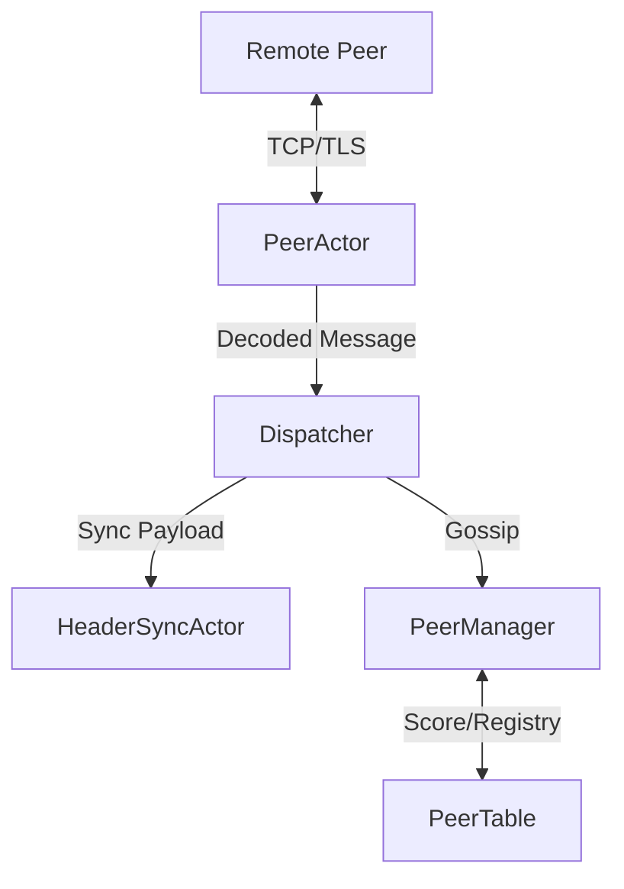

# P2P Networking Specification

The Bitcrab P2P system is a high-performance, strictly Bitcoin Core-compatible networking layer. I have engineered it using a **Supervised Actor Model** to ensure resilience, thread safety, and protocol correctness.

## 🏛️ Bitcoin Core "Gold Standard" Reference

Bitcrab adheres to the Bitcoin P2P wire protocol (Version 70015+).

### 1. Wire Format (Message Framing)
Every protocol message follows the standard 24-byte header:
| Offset | Size | Name | Description |
|--------|------|------|-------------|
| 0 | 4 | Magic | Network identifier (e.g., `0x0A03CF40` for Signet) |
| 4 | 12 | Command | Null-padded ASCII command (e.g., `version\0\0\0\0\0`) |
| 16 | 4 | Length | Length of the payload in bytes |
| 20 | 4 | Checksum | First 4 bytes of `SHA256(SHA256(payload))` |

### 2. Handshake State Machine
Bitcrab strictly enforces the standard Bitcoin handshake (RFC-001 style):
1. **Connect**: Establish TCP session.
2. **Version Swap**: Send `version`, receive `version`.
3. **Verack Swap**: Send `verack`, receive `verack`.
*Note: Any message received before `verack` (except `version`) leads to immediate disconnection.*

---

## 🦀 Bitcrab Implementation: Supervised Actor Model

I have mapped Bitcoin Core's monolithic networking logic into a decentralized actor system.

### 1. Actor Mappings
| Bitcoin Core | Bitcrab Actor | Responsibility |
| :--- | :--- | :--- |
| `CConnman` | **PeerManager** | Global connection limits and inbound connection orchestration. |
| `CNode` | **PeerActor** | Managing a single TCP stream's lifecycle and framing. |
| `AddrMan` | **PeerTable** | Registry of active peers and their misbehavior scores. |

### 2. The Supervision Tree
By using an actor model, I ensure that one peer's failure (panic or protocol error) never affects the rest of the node.
- **Panic Safety**: If a `PeerActor` crashes, the `PeerTable` automatically detects the channel hangup and cleans up resources.
- **Zero-Locks**: Protocol state transitions happen through private actor state, eliminating the risk of deadlocks commonly found in manual mutex-based networking code.

### Network Message Flow

## 🛠️ Security & Resilience

1.  **Misbehavior Scoring**: I implement a 100-point reputation system. Invalid protocol messages result in score deductions. At 0, the peer is banned.
2.  **Async Framing**: I leverage `tokio-util` and `LengthFieldPrepender` logic (customized for Bitcoin) to ensure all I/O is non-blocking and memory-safe.
3.  **Backpressure**: The actor system uses bounded `mpsc` channels to ensure that a slow storage engine doesn't flood the network's event loop.
