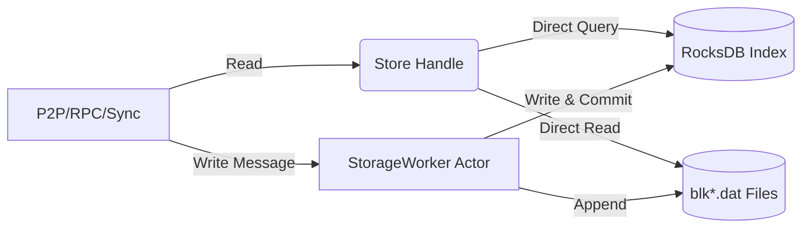

# Storage and Persistence Specification

Bitcrab's storage engine is designed for high-performance blockchain persistence, mirroring the data layout and indexing logic of Bitcoin Core while utilizing a modern asynchronous architecture to prevent disk I/O from blocking network operations.

## 🏛️ Bitcoin Core "Gold Standard" Reference

Bitcrab implements the standard Bitcoin Core storage hierarchy, which consists of two main components: flat-file block storage and a keyed metadata index.

### 1. Raw Block Storage (`blk*.dat`)
Blocks are stored in append-only files in the project's data directory. 
- **File Format**: Linear sequences of block records.
- **Record Structure**:
    - `[Magic (4 bytes)]`: Network identifier (e.g., `0xF9BEB4D9` for Mainnet, `0x0A03CF40` for Signet).
    - `[Size (4 bytes)]`: Length of the serialized block in Little-Endian.
    - `[Block Data (N bytes)]`: The raw serialized Bitcoin block.

### 2. Metadata Index (The "Block Index")
A Key-Value database (LevelDB in Core, RocksDB in Bitcrab) that maps headers to their physical location and tracks validation state.
- **Key Prefixes**:
    - `b` + `[32-byte hash]`: Block index entry (height, status, file position).
    - `C` + `[outpoint]`: Coin (UTXO) record.
    - `B`: The hash of the current best chain tip.
    - `l`: The file number of the last `blk*.dat` file written.

---

## 🦀 Bitcrab Implementation: Hybrid Service Model

I have implemented this specification using a **Hybrid Service Architecture** that decouples data retrieval from data mutation.

### 1. Concurrent Read Handle (`Store`)
The storage layer provides a thread-safe handle that allows multiple components (RPC, PeerManager, Sync) to read data simultaneously.
- **Lock-Free Indexing**: Reads from RocksDB are performed directly against the backend.
- **Parallel Disk Access**: Multiple `blk*.dat` files can be read in parallel by different threads without worker mediation.

### 2. Sequential Write Actor (`StorageWorker`)
All disk mutations and database writes are orchestrated by a single-threaded background actor.
- **Ordered Operations**: I ensure that block storage and index updates are atomic and sequential.
- **Async Communication**: Components send `WriteMessage` requests via `mpsc` channels and receive results through `oneshot` replies.

### Storage Data Flow

## 🛠️ Performance Optimizations

1.  **RocksDB Integration**: I replaced the standard LevelDB with RocksDB to leverage its superior multi-threaded performance and compression support in Rust.
2.  **Height-to-Hash Index**: In addition to standard Core prefixes, I implemented an `H` prefix (`H` + `BigEndian(Height)`) to enable instant block lookups by height for the JSON-RPC interface.
3.  **FlatFilePos Manager**: I built a dedicated rotation manager that handles file pre-allocation and `fsync` strategies, ensuring that Bitcrab remains resilient against power failures and system crashes.
