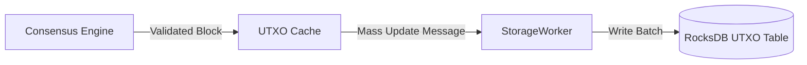

# Transaction & UTXO Specification

Bitcrab follows the Unspent Transaction Output (UTXO) model, ensuring that every satoshi in the system can be traced back to its origin while maintaining high-performance lookup and validation throughout the synchronization process.

## 🏛️ Bitcoin Core "Gold Standard" Reference

The state of the Bitcoin blockchain is represent by the set of all unspent transaction outputs.

### 1. The Coin Object
A "Coin" is a record of an unspent output. It consists of:
- **Value**: Amount of satoshis.
- **ScriptPubKey**: The locking script that determines how the coin can be spent.
- **Height**: The block height where this output was created.
- **Coinbase**: A flag indicating if this was a coinbase output (required for the 100-block maturity rule).

### 2. UTXO Database (`chainstate`)
In Bitcoin Core, coins are keyed by their `OutPoint` (TxID + Vout).
- **Prefix `C`**: Used to identify coin records.
- **Compression**: Core uses a specialized variable-int encoding and script compression to minimize disk footprint.

---

## 🦀 Bitcrab Implementation: Persistent Coin Management

I have implemented a high-speed UTXO management system using RocksDB and an actor-based mutation pipeline.

### 1. Storage Schema
Bitcrab mirrors the `C` prefix in the `utxos` table.
- **Key**: `C` + `32-byte TxID` + `4-byte vout`.
- **Serialization**: I use the same compression logic as Bitcoin Core for the `Coin` records, ensuring that Bitcrab's data directory remains compact even at scale.

### 2. Atomic Batch Updates
To maintain integrity during high-speed header/block sync, I use the `StorageWorker` to perform batch updates.

- **Atomicity**: Changes to the UTXO set are committed in a single transaction alongside the `KEY_BEST_BLOCK` update. This prevents the index from becoming a fragmented state in case of a crash.

## 🛠️ Script Execution

1.  **Bitcrab-Consensus Integration**: I pass the UTXO set context into the consensus engine to verify that signatures match the `scriptPubKey` retrieved from the database.
2.  **Maturity Checks**: I ensure that coinbase outputs are only spent after the 100-block maturity window as per the Consensus rules documented in [validation.md](../consensus/validation.md).

By strictly following the Core data format, I ensure that Bitcrab can serve as a reliable foundation for auditing and building blockchain services.
